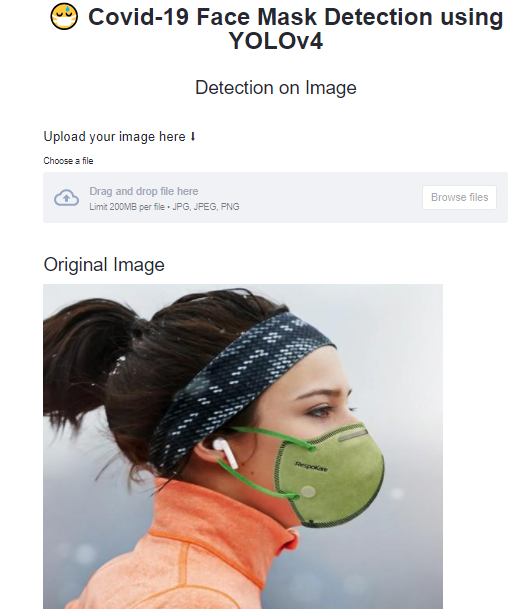
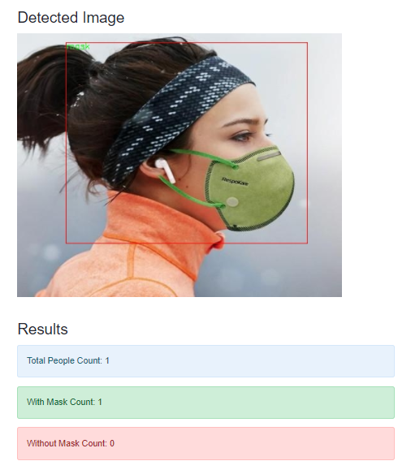
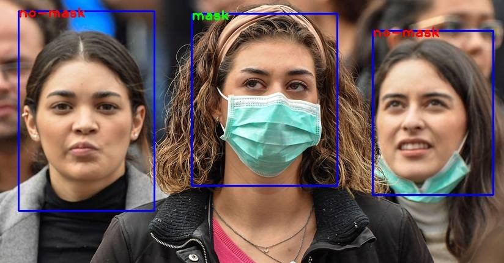

# Face Mask Detection 

Face mask detection system which detects whether a person is wearing a mask or not.

## 🚀&nbsp; Installation

1. Clone the repo
```
$ git clone https://github.com/rutuja1111/CovidFaceMaskDetection.git
```

2. Change your directory to the cloned repo 
```
$ cd CovidFaceMaskDetection
```

3. Now, run the following command in your Terminal/Command Prompt to install the libraries required
```
$ pip3 install -r requirements.txt
```

## :bulb: Working

### Flask app

To run the Face Mask Detector REST API Server
```
$ python3 flask-app.py 
```
### Real-time Video Streams 

To run the Real-time Face Mask Detector 
```
$ python3 CovidFaceMaskDetection.py
```
### Streamlit app
To run the Face Mask Detector webapp using Streamlit
```
$ streamlit run streamlit-app.py 
```

## Front-end User Interface (UI)

<p align="center">Upload Images</p>
<p align="center">
  
</p>

<p align="center">Face Mask Detector Results</p>
<p align="center">
  
</p>

## REST APIs

### Detect Face Mask

#### Request

`POST /detect_mask`

    curl --request POST --url http://localhost:5000/detect_mask --header 'ConficenceThreshold: 0.5' --header 'Content-Type: multipart/form-data; boundary=---011000010111000001101001' --header 'File-Type: jpg' --header 'NMSThreshold: 0.5' --form 'file=@input_images\pic1.jpg' 

#### Response

```json
{
  "algorithm": "YOLOv4",
  "error": false,
  "inference_time_seconds": "1.53",
  "results": [
    {
      "bounding_box_coordinates": {
        "height": 282,
        "width": 238,
        "x_top": 313,
        "y_top": 22
      },
      "confidence": "96.41",
      "label": "mask"
    },
    {
      "bounding_box_coordinates": {
        "height": 269,
        "width": 197,
        "x_top": 609,
        "y_top": 50
      },
      "confidence": "58.89",
      "label": "no-mask"
    },
    {
      "bounding_box_coordinates": {
        "height": 327,
        "width": 222,
        "x_top": 30,
        "y_top": 18
      },
      "confidence": "96.08",
      "label": "no-mask"
    }
  ],
  "status": "ok",
  "total_people_count": 3,
  "with_mask_count": 1,
  "without_mask_count": 2
}
```

### Get Recognized Image

#### Request

`GET /get/detected_image.jpg`

    curl --request GET http://localhost:5000/get/detected_image.jpg

#### Response




 


